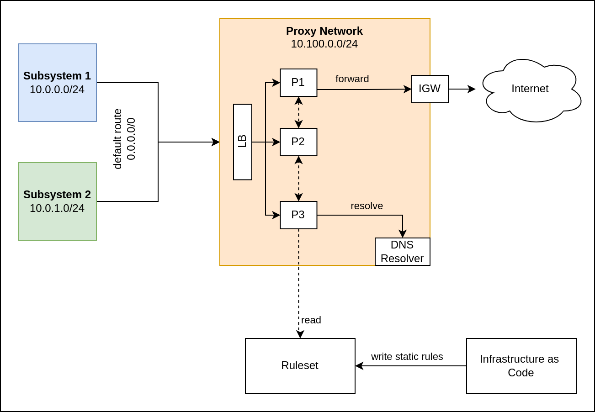
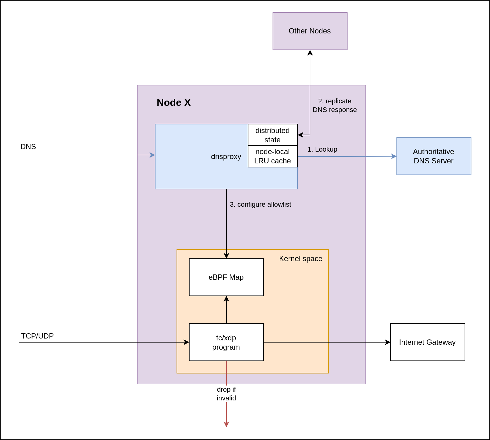

# NEUWERK

## Rationale

This is a cloud-native network egress firewall.

Requirements:

- no change of existing applications needed
- runs as a central infrastructure on the network level to provide strong isolation
- provides dynamic, DNS-based firewall to allow/deny egress traffic

Please also see [moolen/skouter](https://github.com/moolen/skouter) as a counter draft to this traditional, central approach.

## Overview





## TODO

- [x] glob hostnames: distribute state to other nodes
- [x] reconstruct bpf maps from distributed cache
- [ ] config lifecycle management: create / update / remove networks
    - [x] garbage collect old IPs
- [ ] FQDN hostnames: pre-warm + background updates
- [ ] support CIDR allowlist
- [x] integration tests
- [x] cloud integration
- [ ] metrics: map sizes, histograms for: dns queries, map reconcile duration, gc time
- [ ] load and scale tests
- [ ] Configuration API (for terraform or other means)
    - [ ] GRPC/Rest
    - [ ] host/network discovery mechanism (k8s?)
- [ ] consider integration with NLB for DNS load balancing
- [ ] multi-az deployment
- [ ] audit mode
- [ ] AWS GWLB integration (NAT?!)
- [ ] software upgrade & maintenance automation


## Configuration Proposal

```yaml
networks:
- name: "development"
  cidr: 10.0.1.0/24
  policies:
    - hostname: github.com
      ports: [443]
    - hostname: httpbin.org
      ports: [443]
    - hostname: dev.*.acme-inc.com
      ports: [443]
    - cidr: 40.96.0.0/13
      ports:
      - 443
      - 8080
    - cidr: 13.107.6.152/31
    - ip: 1.2.3.4
      ports: [443]
    - ip: 8.8.8.8
      ports: [53]
      protocol: UDP

- name: "production"
  cidr: 10.0.2.0/24
  policies:
  - hostname: example.com
    ports: [443]

# produces a list of ip addresses
# which will be matched explicitly against source IPs
# and the defined egress policies apply.
serviceDiscovery:
- provider: kubernetes
  auth: { ... }
  entities:
    - namespace: "notification-service"
      pods:
        labelSelector:
          app: notification-service
      policies:
      - hostname: github.com
        ports: [443]
      - hostname: httpbin.org
        ports: [443]
```

### Trying it out

place your public key into a file `variables.tfvars`:

```
ssh_pubkey = "ssh-rsa ....."
```

Then run & apply
```
$ cd tf/
$ make apply
$ make deploy SSH_KEY_PRIVATE=~/.ssh/my-private-key.pem
$ make run SSH_KEY_PRIVATE=~/.ssh/my-private-key.pem
```
That will open a `tmux` session with 5 windows: 3 `neuwerk` instances, a `testbox` and a local shell.

Start neuwerk with the following commands on each node:
```
$ sudo sed -i s/127.0.0.53/10.0.0.2/g /etc/resolv.conf
$ sudo systemctl stop systemd-resolved
$ sudo ./neuwerk
```

Then switch to the `testbox` node and run the e2e tests:

```
$ sudo ./e2e.test
```
