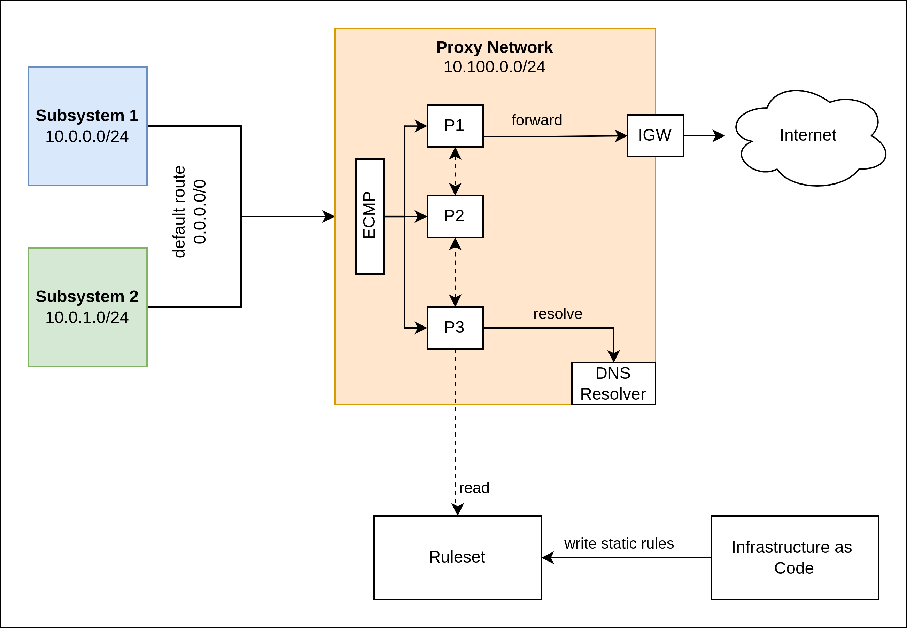

# NEUWERK

## Overview




## TODO

HA
- [x] glob hostnames: fan-out messaging
- [x] reconstruct bpf maps from distributed cache
- [ ] config lifecycle management: create / update / remove networks
- [ ] FQDN hostnames: pre-warm + background updates
- [ ] support CIDR allowlist
- [ ] integration tests
- [ ] load tests

## Configuration Proposal

```yaml
networks:
- name: "development"
  cidr: 10.0.1.0/24
  policies:
    - hostname: github.com
      ports: [443]
    - hostname: httpbin.org
      ports: [443]
    - hostname: dev.*.acme-inc.com
      ports: [443]
    - cidr: 40.96.0.0/13
      ports:
      - 443
      - 8080
    - cidr: 13.107.6.152/31
    - ip: 1.2.3.4
      ports: [443]
    - ip: 8.8.8.8
      ports: [53]
      protocol: UDP

- name: "production"
  cidr: 10.0.2.0/24
  policies:
  - hostname: example.com
    ports: [443]

# produces a list of ip addresses
# which will be matched explicitly against source IPs
# and the defined egress policies apply.
serviceDiscovery:
- provider: kubernetes
  auth: { ... }
  entities:
    - namespace: "notification-service"
      pods:
        labelSelector:
          app: notification-service
      policies:
      - hostname: github.com
        ports: [443]
      - hostname: httpbin.org
        ports: [443]
```

Starting the application
```
$ vagrant up
$ vagrant ssh proxy1
$ /vagrant/bin/neuwerk \
  --net-device eth1 \
  --peers 192.168.56.5:3322 \
  --peers 192.168.56.6:3322 \
  --memberlist-bind-addr 192.168.56.4 \
  --memberlist-advertise-addr 192.168.56.4 \
  --db-bind-addr 192.168.56.4
```